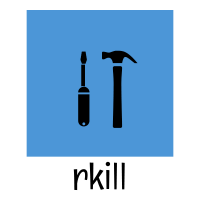

<br />
<p align="center">
  <a href="https://github.com/othneildrew/Best-README-Template">
    
  </a>

  <h3 align="center">rkill</h3>

  <p align="center">
    An interactive cli to kill process. supports linux
    <br />
    <a href="https://github.com/othneildrew/Best-README-Template"><strong>Explore the docs »</strong></a>
    <br />
    <br />
    <a href="https://github.com/othneildrew/Best-README-Template">View Demo</a>
    ·
    <a href="https://github.com/othneildrew/Best-README-Template/issues">Report Bug</a>
    ·
    <a href="https://github.com/othneildrew/Best-README-Template/issues">Request Feature</a>
  </p>
</p>

## Interactive UI

Run `rkill` to launch the interactive UI.

[](https://asciinema.org/a/CMK6UCxTt6UpMIcEOBnUrUaBw)

### Built With

- [Rust](https://www.rust-lang.org/)

### Installation

1. Clone the repo
   ```sh
   git clone https://github.com/SachinMaharana/rkill.git
   ```
2. Build the project
   ```sh
   cargo build --release
   ```
3. Copy binary to bin folder
   ```JS
   cp ./target/release/rkill /usr/local/bin
   ```
4. Run
   ```
   rkill
   ```

## Roadmap

See the [open issues](https://github.com/sachinmaharana/rkill/issues) for a list of proposed features (and known issues).

<!-- CONTRIBUTING -->

## Contributing

Contributions are what make the open source community such an amazing place to be learn, inspire, and create. Any contributions you make are **greatly appreciated**.

1. Fork the Project
2. Create your Feature Branch (`git checkout -b feature/AmazingFeature`)
3. Commit your Changes (`git commit -m 'Add some AmazingFeature'`)
4. Push to the Branch (`git push origin feature/AmazingFeature`)
5. Open a Pull Request

<!-- LICENSE -->

## License

Distributed under the MIT License. See `LICENSE` for more information.

<!-- CONTACT -->

## Contact

Project Link: [https://github.com/sachinmaharana/rkill](https://github.com/sachinmaharana/rkill)
